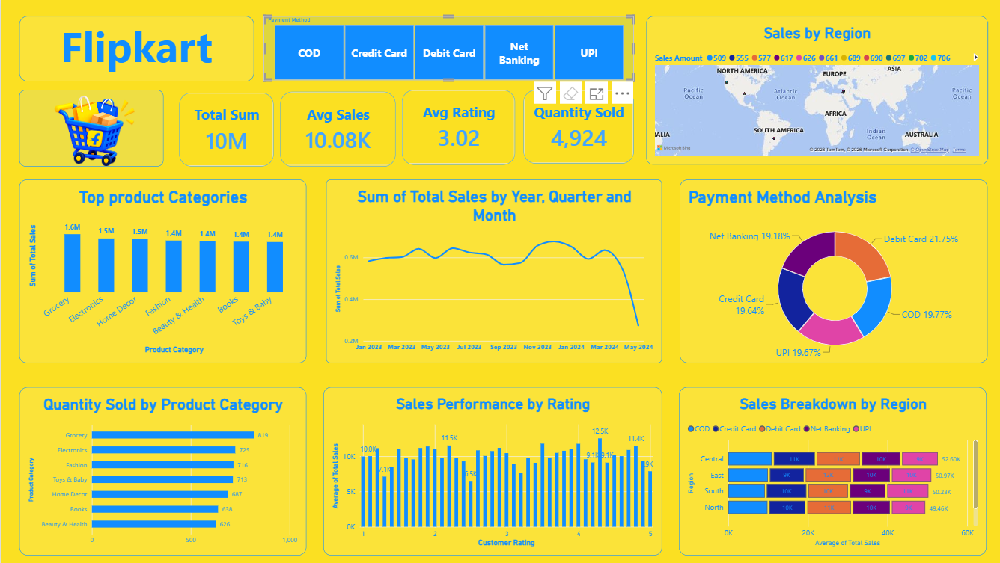

# Flipkart Sales Performance Dashboard

## Overview

An interactive Power BI dashboard developed to track Flipkart sales performance, customer behaviour, payment preferences, product categories, and regional sales.

## Objectives

- Track sales performance over time
- Compare product categories
- Understand customer ratings
- Analyze payment method preferences
- Compare regional sales performance

## Data Preparation

The dataset was cleaned and transformed before building the dashboard. Data quality checks, formatting, and preparation were performed to make the dataset suitable for analysis and visualization.

## Key Metrics

- Total Sales: ₹10.08M
- Quantity Sold: 4,924
- Average Rating: 3.02
- Top Category: Grocery

## Dashboard

## Tools

- Power BI
- Power Query
- Microsoft Excel
- DAX
